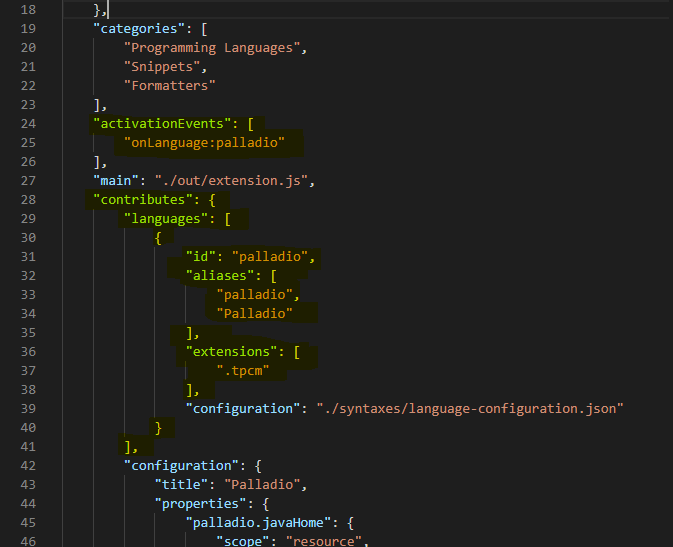
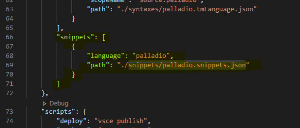

Palladio goes VS Code
=========================

This project is the result of the practical training **Werkzeuge für Agile Modellierung** focused on **Palladio goes VS Code**. The README.md acts like an introduction into the tasks, background and as a guideline for the project. In the following you will 

## Table of Contents
1. [Project Introduction](#project-introduction)
2. [VSCode Extension](#vscode-extension)
3. [Palladio Language Extensions](#palladio-language-extensions)
    * [Syntax Highlight Guide](#syntax-highlight-guide)
    * [Snippet Guide](#snippet-guide)
    * [Language Configuration Guide](#language-configuration-guide)
4. [Palladio Language Server](#palladio-language-server)
    * [Definition Language Server and Language Server Protocol
](#definition-language-server-and-language-server-protocol)
    * [Integration of Palladio Language Server](#integration-of-palladio-language-server)
5. [Continuous Integration](#continuous-integration)
    * [Testing Extension](#testing-extension)
    * [Publishing Extension](#publishing-extension)
    * [Automated Deployment](#automated-deployment)
6. [Future work & ToDo´s](#future-work-&-todo´s)

## Project Introduction

One can see the increased interests of developers to use lightweight text-editors like [Sublime Text](https://www.sublimetext.com/), [Atom](https://atom.io/) or [Visual Studio Code](https://code.visualstudio.com/) for building new applications.


At KIT we have developed an own framework for modelling and analyse softwaresystems, called [Palladio](https://www.palladio-simulator.com/home/). In the past it was only possilbe to use the ide [eclipse](https://www.eclipse.org/downloads/) for developing with `palladio` efficiently, since there was assisting functions like autocompletion and syntax highlighting for developers. 

As mentioned, due to the increased popularity of light-weight text editors, there was an idea to implement `palladio` support for vscode as well. The concept is based on using the vscode api for creating extension and the already existing language server for `palladio` to develop a vscode extension for palladio.

The motivation is to create a pipeline for building and testing the extension and finally publish it to the marketplace automatically together with the latest language server based on the devops principles.
For this we are using different technologies like NPM, Gradle and GitHub Actions. Developers should be able to just download the extension from the marketplace and use it as a support for `palladio` projects.

## VSCode Extension

Visual Studio Code (=vscode) is built with modularity and extensibility in mind. There are multiple ways to extend vscodes funtionality using so called `extensions`. Using the official [extension api](https://code.visualstudio.com/api) one can write powerful supporting services for any usecase. 

### What are extension used for?
* Change the look of VS Code with a color or file icon theme
* Add custom components & views in the UI
* Create a Webview to display a custom webpage built with HTML/CSS/JS
* Support a new programming language
* Support debugging a specific runtime

We will mainly focus on creating an extension for a new programming language/framework support. In the following chapters, we will see each extension support implemented in the new extension, which are syntax highlighting, snippet completion, bracket matching & autoclosing and the integration of the own palladio language server for more supporting.

## Palladio Language Extensions

Before starting everything, make sure you installed [Node](https://nodejs.org/en/) on your workstation, since vscode is also a `node` project, we will need it to implement our extension.
The easiest way to create a vscode extension is to generate one using a tool called (Yeoman)[https://yeoman.io/] created by a bunch of guys which helps developers to kickstart a new project. Using the following command you can install `Yeoman` with the vscode extension generation support.

```
npm install -g yo generator-code
```

Once installed `yo`, I created the scaffolding of the extension using the following command and get through the interactive configuraion of it. 

```
yo code
```

For our extension, I created a new [Typescript](https://www.typescriptlang.org/) based extension with `npm` as package manager. The other alternative was using plain `javascript` for the extension and `yarn` as the package manager. Since I am very well familiar with `Typescript` and `npm`, I used them here.

After the interactive configuraion, the extension template was created in the directory named "palladio" within the directory `yo` was started. To open it in vscode call the following command.

```
cd palladio

code .
```

The generated common extension will only activates for a command. In our case, we want to activate our extension as soon as there is a file with the ending `.tpcm` (for example `hello.tpcm`). To change that we have to configure the `activationEvents` and set the language configuration under `contributes` -> `languages` in the `package.json` file like the picture shows. See the marked lines.



From now on, once a file with ending `.tpcm` is created, the extension will be started. 

### Syntax Highlight Guide

Syntax highlighting determines the color and style of source code displayed in the Visual Studio Code editor. It is responsilbe for coloring keywords like `import` or `for` in Java differently than comments or Strings. This colorized keywords support gives the developer a nice feeling, while programming, since he can visually see automatically if the programm has some syntax error only by color. There are two components to syntax highlighting, Tokenization and Theming.

The tokenization of text is about breaking the text into segments to classify each segment with a token type. After getting the tokens for each word, we can map different colors to different tokens. For this purpose of coloring relevant keywords, vscode is using [TextMate grammars](https://macromates.com/manual/en/language_grammars) as a syntax tokenization engine.

For creating an own grammar for syntax highlighting, using `yo` use again the following command select the New Language option.

```
yo code
```

That will create a `syntaxes` directory containing the grammer json file, here `palladio.tmLanguage.json`. Also it will add the following language configuration to your `package.json` under`contributes` -> `grammars`.


Note that `yo` will ask in the interactive configuration for the `Language Id`, `Language Name` and `Scope names`. The `Scope name` is the root TextMate scope name for the palladio grammer, which is `source.palladio` in this case. The path parameters value will be the path to the newly created grammer file.

If we open `palladio.tmLanguage.json`, we can see a bunch of settings, also the file types this grammer is used for. For `palladio` that value should be `.tpcm`. Furthermore we try to separate each text block in the following chunks for better readability. 

* entities
* keywords
* storages
* lambda-expression
* supports
* operator


For each section we define the patterns used for matching a word and the name of the token for coloring it. There are a couple of names for some main general tokens used in most programming language which have standard themes. Using them one can be sure that a user does not have to set a custom color for a new token for highlight it. You can find a good list [here](https://www.apeth.com/nonblog/stories/textmatebundle.html). One example for a token name is `comment`, which has in vscodes default Java environment the color green.


Theming is about mapping colors and styles to tokens. The theming rules are specified in color themes, but they can be customized by the user settings. The [Color Theme Guide](https://code.visualstudio.com/api/extension-guides/color-theme#syntax-colors) explains how a user can create a custom color theme.

### Snippet Guide

Under `contributes` -> `snippets` I added the configuration for an initial snippet file path. Therfore I created a directory called `snippets` and a file called `palladio.snippets.json`. 




A snippet is a pre-written template for boilerplate code. In most cases it makes the life of a developer simpler by autocreate some code as you can see in the animation.


Just by typing special keywords, the user can select from vscodes suggestions the right snippet to create his boilerplate code. By clicking `<TAB>` the user can jumb directly to the next place for edit. Here you see an example for a snippet to create a `repository` in palladio by typing `repo`. Note that with `${number}` one can controll the jump point when `<TAB>` was clicked.


### Language Configuration Guide

The `contributes.languages` in `package.json` allows you to define a language configuration that controls the following Declarative Language Features:

* Comment toggling
* Brackets definition
* Autoclosing
* Autosurrounding
* Folding
* Word pattern
* Indentation Rules

Since `palladio` is basically a Java based framework, we can use the same default `language-configuration.json` file as the programming language Java. In the following I try to explain each configuration made in the configuration file.


#### Comment toggling
Vscode offers 2 types of comment, lineComment and blockComment.
`palladio` supports both, hence both were configured with `//` and `/*....*/`.

#### Brackets

When you move the cursor to a bracket defined here, VS Code will highlight that bracket together with its matching pair. In `palladio` we support the follwing 3 types of bracket.

```
{}, (), []
```

#### Autoclosing

As the names already say, we can use autoclosing to autoclose a started bracket. If the user types `(` automatically the matching endbracket `)` will be added. In the configuration we can also exlude this functionality in certain places, like within Strings or comments.

#### Autosurrounding

When a user selects a range in VS Code and enter an opening bracket, VS Code surrounds the selected content with a pair of brackets. Here we defined all the autosurrounding pairs for `palladio`.

#### Folding

The folding mechanism is the function where a user can click on a small arrow next to the line numbers in the editior to collapse a specific region. There are three kinds of folding in palladio. Indentation-based folding, where all lines of the same indentation level will be within one region. Language configuration folding, where we have to configure the markers as shown in the picture for specifying a region. The last method is using the language server to define a region, which we did not do.

## Palladio Language Server

The external way of supporting a language, like `palladio`, is with the help of a language server. With Language Servers, you can implement autocomplete, error-checking (diagnostics), jump-to-definition, and many other language features supported in VS Code. Fortunately there is already an implementation of a palladio language server based on java. The built language server is a jar type file, hence we need to install Java (currently openjdk version "14.0.1" should be fine) on the workstation we work on. But first let us define language server. Why we neet it? How we can use it for an extension?

### Definition Language Server and Language Server Protocol

"A Language Server is meant to provide the language-specific smarts and communicate with development tools over a protocol that enables inter-process communication." [- microsoft](https://microsoft.github.io/language-server-protocol/)

Basically a language server and the development tools are communicating each other. Thus the language server can provide language-specific information like autocompletion and method information based on users typing. Also analyzing users input, validate and give some error hints to the user is not a problam at all. The only problem was that language server were implemented in their native programming languages and were not compatibel with the developer tools from vscode. Integrating multiple language toolings with multiple code editors could involve significant effort, since one language server is necessary for each code editor. This makes implementing language support for `M` languages in `N` code editors the work of `M * N`.

Microsoft solves that problem by introducing a new protocol, called the [Language Server Protocol](https://microsoft.github.io/language-server-protocol/), which standardizes the communication between language server and code editor. This way a language server can be implemented in any programming language and run in theit own process. As long it is talking to the code editor over the lsp, there are no problems. That means a LSP-compliant language server can be used by any LSP-compliant code editor. This decreases the complexity dramatically from `M * N` to just `M`. 


### Integration of Palladio Language Server

Here you can find the [palladio language server](https://github.com/PalladioSimulator/Palladio-Addons-TextBasedModelGenerator). For integrating the language server to our extension, we need to start the language server jar file, when the extension gets activated. Before we can start the server, we have to find out the way the server is normally started. With the followong command you can start the server manually from command line.

```
java -jar launcher\tpcm-language-server.jar
```

That means we need 2 external parameter to start the server. One is of course the location of installed java to call it and the other one is the location of the language server. Normally if `JAVA_HOME` is set, there should be no problems to find its location via `process.env["JAVA_HOME"]`, but sometimes users miss to set `JAVA_HOME`. Since the palladio-vscode extension is shipped together with the language server, we have always the default vscode extension location. 


Nevertheless I implemented custom user parameter setting for both (palladio.javaHome & palladio.languageServer) to make sure that a user can set the paths manually in case of the default values are not suitable. You can implement custom user paramter in `package.json` and fetch them using `vscode.workspace.getConfiguration("palladio").get("paramterName")`.


If the values are empty, the default ones will be taken.
To build the server options use the `JAVA_HOME` path and concatenate it with `bin` and `java`. Pass along the arguments `-jar` and the path of the languageserver. 


The built command would look like:

```
C:\Users\...\scoop\apps\openjdk\current\bin\java -jar launcher\tpcm-language-server.jar
```

Once we created our server options, we have to create the client options. The client options describes the scheme and the language name, it should be watching for. Make sure that the language name (here `palladio`) is the same as in `package.json` under `contributes.languages`.


If we have both, server option and client option, we can use them to build the client and start the server and the extension by `client.start()`. In the follwing you can see the main `activate` method in `extension.ts`, which will be executed once a file with `.tpcm` ending detected.


To download the latest version of the language server, I used [Gradle](https://gradle.org/). In the following you can see the `build.gradle` file, where I defined `copyDependencies` function to copy the latest language server from `$mvnRepository` with version `$languageServerVersion` which is defined in `gradle.properties` to a directory called `launcher`.


## Continuous Integration

To provide an automated way for building up the extension, testing it and publish it we use continuous integration and delivery. Before we checkout how the automated way is done, first we have to look how to manually test and publish an extenstion.

### Testing Extension

Visual Studio Code supports running tests for extensions. The scaffolding, which was created with `yo` came along with a `test` folder. The `runTests` method in `runTest.ts` will automatically download a specified version of visual studio code and open it for testing purposes.

Due to time reason I was only able to create a simple unit test to check if the downloaded language server is able to start successfully or crash after starting. For more details on vs code test api, have a look [here](https://github.com/microsoft/vscode-test). Another source for some example is [vscode.rocks](https://vscode.rocks/testing/).

### Publishing Extension

To publish an extension, we have to install first `vsce` (Visual Studio Code Extensions) using follwing command. 

```
npm install -g vsce
```
Also a Personal Access Tokens is necessary for publishing extension. For more information how to create a Personal Access Tokens see [this](https://docs.microsoft.com/azure/devops/integrate/get-started/authentication/pats).
Using `vsce` I was able to package and publish the palladio extension using:

```
vsce package
# palladio.vsix generated for local testing
vsce publish
# <publisherID>.palladio published to VS Code MarketPlace
```

Note that before publishing, one has to increase the version number manually in the `package.json` file. To install a locally packaged extensions using `vsce package` use the following command.

```
code --install-extension palladio-0.0.1.vsix
```

### Automated Deployment

To perform the whole build, test and publish automatically, I used [Github Actions](https://github.com/features/actions), since the code also lies there. To start I created a file under `.github\workflows\main.yml`, which contains steps to perform on specified trigger-action. In our case the trigger is a commit on the master branch.


As you can see on line 7, the action called **Deploy Extension** will start when code is deployed to the master branch. In this particluar example we have only one job called `build`, which contains 5 main steps.

* Run a one-line script - Logging that deploy process started
* npm install - Run the command `npm install` to install all dependencies for that project
* Copy Language Server - Use gradle to download and copy the language server to directory `launcher`
* Run tests - Use xvfb, since vscode test will need a UI. Run `npm test` for runnig the implemented tests.
* npm run deploy - Finally run deploy, which will call `vsce publish` with the access token which was secured within githubs secret variables. 

Note here to increase the version number manually aswell. The last step to deploy will only be started if the previous tests were succussfully

## Future work & ToDo´s

- [ ] Change meta data in `package.json` (publisher id, ...)
- [ ] Test more cases using the API, e.g. if language server is responding with correct suggestions
- [ ] Create more jobs on the github action (build, test, package, deploy)
- [ ] Create more triggers on the github action for different usecases ()


